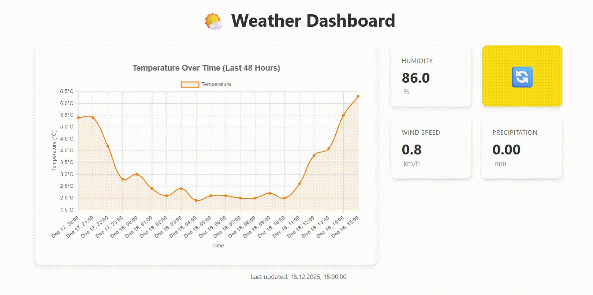

# Lernperiode-12

## Showcase

Working with Microsoft SQL DB, Python Flask and Chart.js, I created a dashboard for local weather. Fitted with insightful graph and a sync button, you can determine how to  dress yourself today!

  

## Key positions in code

The **auto_update** method fills in all missing hourly data from the last saved timestamp to now, ensuring no duplicates, or retrieves a new set of data, incase the app hasn't been used for two days.
```python
        # Get the last saved timestamp from database
        cursor.execute("SELECT MAX(timestamp) FROM WeatherMeasurement")
        last_saved_time = cursor.fetchone()[0]

        if last_saved_time is None:
            last_saved_time = datetime.now() - timedelta(hours=48)
            print("No previous data found. Starting from 48 hours ago.")
        else:
            print(f"Last saved time: {last_saved_time}")

        # Fetch weather data for City...
```
Meanwhile the **app.py** is responsible for handling requests. A GET route `/weather-measurement` retrieves data from DB, filtering server-side.
```python
@app.route("/weather-measurement")
def weather_measurent():
    cursor.execute("""
        SELECT
            timestamp,
            temperature,
            humidity,
            windspeed,
            precipitation
        FROM WeatherMeasurement
        WHERE timestamp >= DATEADD(HOUR, -48, GETDATE())
          AND temperature IS NOT NULL
          AND humidity IS NOT NULL
          AND windspeed IS NOT NULL
          AND precipitation IS NOT NULL
        ORDER BY timestamp ASC
""")
```
And POST `/refresh-data` updates DB with latest data, which the ever growing amount can be later used for analytics.
```python
@app.route("/refresh-data", methods=["POST"])
def refresh_data():
    try:
        update_weather_data()
        return jsonify({"success": True, "message": "Data updated successfully"})
```


## Introduction / Einführung

Technologien, und warum:

Ich möchte mein nächstes Projekt mit meinem Interesse an der FHNW und dem Studiengang, den ich dort absolvieren möchte, verbinden. Eines der Themen ist das Thema IoT. Ich habe mir ein Projekt überlegt, das semi mit API arbeitet. Dabei möchte ich auch Datenbanken verwenden (entweder MongoDB oder SQL, ich bin noch unentschieden). Ich möchte die Daten mit Python verarbeiten. Für die Darstellung werde ich mit neuen für mich Wegen für Web Dev (Flask + Chart.js) arbeiten. (70)

Grobe Beschreibung des Projekts:

Ich möchte ein interaktives Dashboard entwickeln, das reale Wetterdaten mit simulierten Pflanzensensordaten kombiniert. Das Dashboard wird:

- aktuelle Messwerte der Pflanzen und Wetterbedingungen anzeigen

- historische Trends visualisieren

- den Wasserbedarf der Pflanzen für die nächsten 24 Stunden vorhersagen

- alle Daten anschaulich darstellen

Ziel des Projekts ist es, praktische Erfahrung mit APIs, Datenbanken, Datenverarbeitung und Visualisierung zu sammeln und ein besseres Verständnis für IoT-Systeme zu entwickeln. (68)

*Notice: A decision I made on start, that this project will largely be carried out using AI. And that I will document my work in English.*

*28.11 Notice: Because I use Jupyter, I use less AI, for writing in notebook is more try-and-error friendly, and so I can try a lot on my own.*

1. As the developer, I want to have a plan and starting point from which I want to develop from, in order to apply further changes and epics. (start block)

2. As the developer, I want to be sure that everything is connected, in order to have security that the system works reliably (back-end block)

3. As a student developer, I want to visualize all collected and predicted data in one dashboard, in order to connect weather, plants, and predictions in a meaningful way. (front-end block)

4. As a person who wants to know what to dress today, I want to see the current weather and forecast, in order to choose clothes that match the temperature and conditions. (is this an epic?)

5. As my mum who wants to know when the plant was last watered, I want to see a clear watering history and next predicted watering time, in order to care for the plants efficiently. (design block)

6. As a person who cares how the work is documented, I want to see code as infrastructure and smart commit names, in order to understand the design and learning outcomes of the project. (refactoring block)

# Daily plans

## 07.11

As the developer, I want to have a plan and starting point from which I want to develop from, in order to apply further changes and epics.

- [x] As the developer, I want to draw a plan and all my ideas
  
  - [x] Schema of connections
  
  - [x] What is involved in the projects and what not
  
  - [x] The end result

- [x] Build a connection to a open meteo

- [x] Create script that generates appropriate plant data according to my room plants

Today I began with pre-planning and gathering my ideas into my project book. Following that I checked out possibilites for APIs and opened VSC to build connection with open-meteo. During work I mainly used terminal to access files, which I liked. From the session I am taking away that open-meteo is a free weather API, and that venv is a **v**irtual **env**ironment to run python scripts. I am motivated for this project and happy with my work today. (78)

## 14.11

Background story: I have 15 pictures. I want these 15 pictures printed out on an A4-paper so that I can cut them out. 

The Problem: I use paint to arrange the pictures. Pasting the pictures, arranging them to appropriate sizes and correcting the position is a tedious task. Since I do this every month, the amount of pictures changes. And the size of a picture is also variable, for some need to be bigger than others.

My solution: I will create a program that can take pictures and distribute them on a A4 paper in order to print the paper and be able to cut them out.

- [x] Find library

- [x] Test script

- [x] estimate how long transfering this idea onto a website to allow for interactive adjusting of images could take
  
  - [x] by finding out the technology on the internet

Today I consulted my idea for the side project I started working on. The function of the programm could come in handy to me now, but I understimated the difficulty of it. I began with writing Background, the problem and the solution to allows others to imagine what I mean. My current programme can mash allpicture all pictures into one at the moment. The library I tried does a worse job. I am deciding I will continue with original project, leaving other one for the weeknds or other time. (109)

## 21.11

As the developer, I want to be sure that everything is connected, in order to have security that the system works reliably

By date:

- [x] As an employer I want to know why this specific database was chosen in order to evaluate developer's technical competence.
  - [x] SQL VS NoSQL. what is my use case?
    I considered between SQL and NoSQL. The general consensus is to use NoSQL for IoT. However for the scale of my project I choose SQL, for the data I will work with is well structured, whereas only in NoSQL I'd benefit from the unstructured data. Another advantage NoSQL would bring was the ability to perform sharding, which I am not anticipating to do. Last but not least I imagine working with structured that will be easier for me, to do queries and such in comparisson to key-value pairs.
  - [x] SQL: draw model in umlet

On date:

- [x] Given the server is ready, if python script is run, then two data sets are input and printed

- [x] Given the connection is working, if expanded python script is run, today's data from meteo are pulled and inserted.

- [ ] Given the script is running, if it is new hour since last data fetch, pull data since that time

Today I had fun. I began with creating scripts to jumpstart a database in SSMS. Then I had to create connection and there pyodbc came in handy. I decided that for the basics I will read documentation and this and that from Microsoft helped. I was able to insert test data, then at the end I had just enough time to perform API request and after that insert and read from DB. Only part missing is to do this task automatically, but working with variables was interesting itself. (88)

Sources:

[Python Dictionaries](https://www.w3schools.com/python/python_dictionaries.asp)

[🌦️ Docs | Open-Meteo.com](https://open-meteo.com/en/docs?hourly=temperature_2m,relative_humidity_2m,cloud_cover&latitude=47.4733&longitude=8.3059)

[Python SQL Driver - pyodbc | Microsoft Learn](https://learn.microsoft.com/en-us/sql/connect/python/pyodbc/python-sql-driver-pyodbc-quickstart?view=sql-server-ver17&tabs=azure-sql)

## 28.11

As a student developer, I want to visualize all collected data in one dashboard, in order to connect weather and plants in a meaningful way. (no predictions, out of scope of the project + open-meteo already supplies that)

By date:

- [ ] Given the script is run, if it is new hour since last data fetch, pull data since that time with one run

On date: 

- [ ] Given there's runtime to handle requests, if client sends request, send data from past 24h to client

- [ ] Given the data is received, display it on a timeline graph

- [ ] Given the client opens the app, if it loads, it displays rough end-product design (block for styling)

Today I started work with turning AP's into github issues, to try out and make my works seem proffessional. Then I went onto a new branch and created another script which will be the working one, as the old one is used for testing. I once again worked with pyodbc and learned how cursor works. I seem to have underestimated this task. The plan was to

`# check last data time`

`# get data from 48 hours`

`    # define end and start`

`# compare pulled data with last inserted time`

`# leave only the data that is higher than max time from db`

`# insert `

`# if there is a gap`

`# then inform there's missing data because pulled from only 48h`

`# missing: x hours`

I realized 1) 48 hours is not a good solution. One could extend by calulating excactly how many hours need to be requested. 2) I am realised I want to use pandas module. But then I ran into issue with converting time. (109)

## 5.12

- [ ] Given the script is run, if it is new hour since last data fetch, pull data since that time with one run

On date: 

- [ ] Given there's runtime to handle requests, if client sends request, send data from past 24h to client

- [ ] Given the data is received, display it on a timeline graph

- [ ] Given the client opens the app, if it loads, it displays rough end-product design

Today I was away from my work station until 15:30 o'clock due to my visit at a company for my intership in Zürich. I'm working on the script. 

### 10.12

Commit dc8f858 states auto insert script has was worked on. However, after few about 2,5h, while it correctly requested data, it also brought participation, meaning it still wasn't fully done. (written on 19.12)

## 19.12

State of project:

⏱️worked 3 times on the project

✅DB

✅Understanding pyodbc

⏹️auto-insert fresh data

⏹️visualisation with flask

Last issue: Couldn't request last two days including hours.

it starts off with from 00:00 two days ago

Last push of project:

By date:

- [x] Given the script is run, if it is new hour since last data fetch, pull data since that **day** with one run

On date:

- [x] Given there's runtime to handle requests (Flask), if client sends request, send data from past **48h (ignoring blanks)** to client

- [x] Given the data is received, display it on a timeline graph with Chart.js

- [x] Reflection and Presentation

Today I began with addressing the issue that I couldn't fix myself. I asked AI for help and got the DB updating script working. Following this everything went smoothly. I turned jupyter notebook to script, then slowly figured out Flask and in the end generated website. With minor missights like `what if DB has no data` or `how to add the sync button`, I brought the project to the bare state I planned it from the beginning. (77)

## Reflexion

Over the course of the project, I noticed clear patterns in how I approach problem‑solving and motivation. Early on, planning on paper and testing connections gave me a strong make‑or‑break validation, which boosted my engagement. When a second project idea appeared, I explored it by outlining background, problem, and solution. This showed that I can evaluate ideas well, but also that I tend to underestimate the work of a task. It's needed time, to be excact.

As the technical work began, I relied on documentation first, as well as Jupyter to keep the process playful and exploratory. And by creating issues and branches on Githug, I gave myself tiny goals which supported my progress. However, whenever I though of a solution too narrowly, it lead to a blocker.

Toward the end, revisiting the project state and lowering expectations helped me regain motivation. I used AI effectively to avoid getting stuck and fixed issues quickly. (154)


VBV:
Whenever I see output of my work, I understand what's going more better than when debugging.
Whenever I describe a user story, it helps to attach acceptance criteria in order to know when it is completed and I can delete branch.
Whenever an issue starts to get complicated, I should consult AI or teacher because solving it too long is unproductive and unmotivating.

## The main good, the smaller bad and the future
My main achievements:

- Do useful visualisation

- Master git flow

My smaller improvements:

- Working with DB

- Setting up useful interconnections

- Working with ever growing data

What I can do to grow this project:

- Allow choosing user's city

- Suggest outdoor wear based on data

- Host scripts to access dashboard just via URL and hand in latest fetch

- Integrate plant section, where plant data is also stored and studied

- Perform forecast based on data (Machine learning, a little out of scope)


